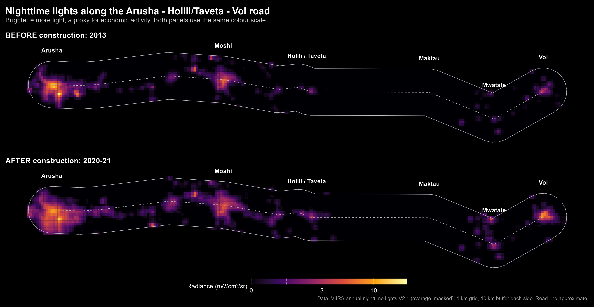
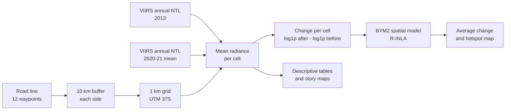
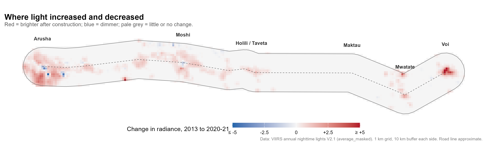
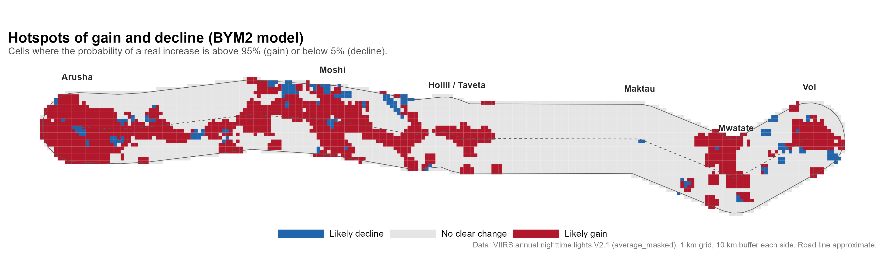
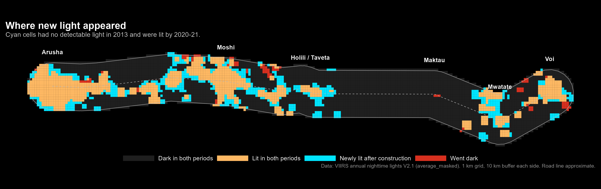

# Lights Along the Corridor

**A before-and-after spatial assessment of economic activity growth along the AfDB-funded Arusha–Holili/Taveta–Voi road, using satellite nighttime lights and a Bayesian spatial model**

Author: Mwesigye Andrew Moses, GIS and Spatial Data Science Consultant, Uganda



## Summary

The Arusha–Holili/Taveta–Voi road links northern Tanzania to the Kenyan coast and was financed by the African Development Bank (AfDB), with works running from 2014 to 2019. This study compares satellite nighttime light (NTL) within 10 km of the road before construction (2013) and after completion (2020–21), on a 1 km grid of 4,895 cells.

| Headline result | Before (2013) | After (2020–21) | Change |
|---|---|---|---|
| Total light in the corridor (sum of lights, nW/cm²/sr) | 846.7 | 1,588.7 | **+87.6%** |
| Lit grid cells | 1,167 | 1,666 | **+42.8%** |
| Newly lit cells | – | 581 | – |
| Cells that went dark | – | 82 | – |

Light increased across about a third of the corridor and declined in under 4% of it. The growth is strongly clustered (Moran's I = 0.79, p < 0.001) around Arusha, Moshi, the Holili/Taveta border, Mwatate and Voi. The section upgraded from gravel to bitumen (Taveta–Mwatate) had the largest relative gain, from a very low base.

These results describe change over the project period. They do not prove that the road caused it; see [Limitations](#limitations).

## Contents

- [Research question](#research-question)
- [Objectives](#objectives)
- [Project background](#project-background)
- [Data](#data)
- [Methodology](#methodology)
- [Results](#results)
- [The story in four maps](#the-story-in-four-maps)
- [Comparison with the AfDB evaluation](#comparison-with-the-afdb-evaluation)
- [Justification](#justification)
- [Limitations](#limitations)
- [How to reproduce](#how-to-reproduce)
- [Repository structure](#repository-structure)
- [References](#references)

## Research question

> Did nighttime light intensity within 10 km of the Arusha–Holili/Taveta–Voi road change significantly between the pre-construction and post-completion periods, and is that change spatially clustered along the corridor?

The question has two parts: **how much** light changed across the corridor, and **where** the change is concentrated.

## Objectives

1. Measure nighttime light in the road corridor before construction and after completion, as a proxy for local economic activity.
2. Estimate the average change across the corridor with a Bayesian spatial model that accounts for neighbouring areas being alike.
3. Map where light increased, decreased or newly appeared, and identify hotspots of gain and decline.
4. Compare the upgraded road sections with the sections that were not upgraded in this phase.
5. Relate the findings to the AfDB's own evaluation of the project.

## Project background

| Item | Detail |
|---|---|
| Project | Multinational: Arusha–Holili/Taveta–Voi Road Project (Tanzania and Kenya) |
| Financier | African Development Bank / African Development Fund |
| Approved | 16 April 2013 |
| Tanzania works | Arusha bypass (42.4 km); dualling of Sakina–Tengeru (14.1 km); roadside amenities at Tengeru |
| Kenya works | Upgrading of Taveta–Mwatate from gravel to bitumen (about 89 km); Taveta bypass (12 km); roadside amenities at Bura and Maktau |
| Border | One Stop Border Post at Holili/Taveta |
| Construction | Mwatate–Taveta contract started February 2014; Kenyan section completed June 2017; Tanzanian components completed April 2019 |
| Reported outcome | Travel time from Arusha to Mombasa cut from 6 to 4 hours (AfDB IDEV, 2025) |

More detail, with sources, is in [docs/afdb_project_context.md](docs/afdb_project_context.md).

## Data

| Dataset | Use | Source | Details |
|---|---|---|---|
| VIIRS Nighttime Day/Night Annual Band Composites V2.1 | Nighttime light before and after | Earth Observation Group, Colorado School of Mines, via Google Earth Engine: `NOAA/VIIRS/DNB/ANNUAL_V21` | Band `average_masked` (background set to zero, fires and other temporary lights removed); about 464 m pixels; radiance in nW/cm²/sr |
| Road alignment | Corridor centreline | Digitised by the author as an approximate line through 12 towns | Arusha, Tengeru, Usa River, Boma Ng'ombe, Moshi, Himo, Holili, Taveta, Maktau, Bura, Mwatate, Voi |
| Corridor buffer | Study area | Derived | 10 km each side of the road line (20 km wide) |
| Analysis grid | Unit of analysis | Derived in Google Earth Engine | 1 km cells in UTM Zone 37S (EPSG:32737); 4,895 cells |
| AfDB transport sector evaluation | Context and comparison | AfDB Independent Development Evaluation (IDEV), 2025 | *A Decade on the Move: Evaluation of the AfDB's Support for the Transport Sector (2012–2023)*, Summary Report |

**Study periods**

- **Before:** the 2013 annual composite. This is the only pre-construction year in the V2.1 annual series, since works began in February 2014.
- **After:** the mean of the 2020 and 2021 annual composites. The last project section was completed in April 2019.

The data dictionary for the exported files is in [data/README.md](data/README.md).

## Methodology



**1. Extraction (Google Earth Engine).** The road line is buffered by 10 km. A 1 km grid is laid over the buffer in UTM 37S. For each cell, the mean VIIRS radiance is calculated for the before and after periods.

**2. Response variable.** For each cell *i*:

```
delta_i = log(1 + NTL_after_i) - log(1 + NTL_before_i)
```

The log transform reduces the influence of the few very bright city cells, and adding 1 keeps unlit cells (radiance 0) in the analysis.

**3. Model.** A Bayesian spatial model of change, fitted with R-INLA:

```
delta_i = b0 + u_i + e_i
```

- `b0` is the average change across the corridor.
- `u_i` is a BYM2 spatial random effect (Riebler et al., 2016). It combines a spatially structured part, where each cell borrows strength from its neighbours, and an unstructured part. The mixing parameter `phi` gives the share of the random-effect variance that is spatially structured.
- `e_i` is Gaussian noise.
- Neighbours are cells sharing an edge or corner (queen contiguity).
- Priors are penalised-complexity priors (Simpson et al., 2017): P(sd > 1) = 0.01 and P(phi < 0.5) = 2/3.

**4. Spatial clustering.** A global Moran's I test on the change values, using the same neighbour structure, checks whether change is clustered independently of the model.

**5. Hotspots.** For each cell, the model gives the posterior probability that the fitted change is above zero. Cells above 0.95 are labelled "likely gain", cells below 0.05 "likely decline", and the rest "no clear change".

**6. Road sections.** Cells are grouped into four sections by the longitude of the cell centre, to compare upgraded and non-upgraded stretches. The boundaries are approximate.

Full details are in [docs/methodology.md](docs/methodology.md).

## Results

### Corridor-wide findings

| Indicator | Value |
|---|---|
| Grid cells in corridor (1 km) | 4,895 |
| Cells lit in either period | 1,748 |
| Cells lit before (2013) | 1,167 (23.8% of corridor) |
| Cells lit after (2020–21) | 1,666 (34.0% of corridor) |
| Newly lit cells (dark in 2013, lit after) | 581 |
| Cells that went dark (lit in 2013, dark after) | 82 |
| Sum of lights before (nW/cm²/sr) | 846.7 |
| Sum of lights after (nW/cm²/sr) | 1,588.7 |
| Change in sum of lights | +87.6% |
| Mean radiance per cell, before | 0.173 |
| Mean radiance per cell, after | 0.325 |
| Model: average change in (1 + NTL) per cell | +8.55% |
| Cells with likely gain (P > 0.95) | 1,494 (30.5%) |
| Cells with no clear change | 3,226 (65.9%) |
| Cells with likely decline (P < 0.05) | 175 (3.6%) |

Source: [outputs/tables/table1_key_findings.csv](outputs/tables/table1_key_findings.csv)

Two of these figures measure different things. The **+87.6%** is the growth in total light, which is dominated by the towns. The **+8.55%** is the average change per grid cell on the log scale, and about two thirds of the cells are unlit in both periods and contribute zero change, which pulls that average down.

### Spatial clustering

| Test | Statistic | Standard deviate | p-value |
|---|---|---|---|
| Global Moran's I on the change per cell (queen contiguity, row-standardised) | 0.790 | 107.7 | < 0.001 |

Moran's I ranges from about −1 (neighbours unlike each other) through 0 (no pattern) to +1 (neighbours alike). A value of 0.79 is very strong positive spatial autocorrelation: cells that gained light sit next to other cells that gained light. This answers the second part of the research question directly. **The change is strongly spatially clustered along the corridor.**

### Model hyperparameters

| Parameter | Posterior mean (95% interval) |
|---|---|
| Precision of the Gaussian noise | 61,310 (21,690 to 135,700) |
| Precision of the BYM2 random effect | 21.21 (20.39 to 22.08) |
| Phi (spatially structured share) | 1.00 (1.00 to 1.00) |

`Phi` is at its upper limit, so the model attributes essentially all the variation in change to spatially structured pattern. This agrees with the Moran's I result above.

The very high noise precision means the model reproduces the observed values almost exactly. This affects how the interval and hotspots should be read; see [Limitations](#limitations).

### Findings by road section

| Section | Cells | Lit before | Lit after | Sum of lights before | Sum of lights after | Change | Gain cells | Decline cells |
|---|---|---|---|---|---|---|---|---|
| 1. Arusha – Usa River (AfDB: dualling and bypass) | 605 | 341 | 425 | 500.2 | 808.3 | +61.6% | 390 | 29 |
| 2. Usa River – Moshi – Holili (not upgraded in this phase) | 1,848 | 537 | 781 | 271.2 | 517.8 | +90.9% | 694 | 94 |
| 3. Taveta – Mwatate (AfDB: upgraded to bitumen) | 1,758 | 113 | 254 | 23.5 | 100.4 | +327.9% | 242 | 8 |
| 4. Mwatate – Voi (existing road) | 684 | 176 | 206 | 51.9 | 162.3 | +212.8% | 168 | 44 |

Source: [outputs/tables/table2_by_road_section.csv](outputs/tables/table2_by_road_section.csv)

- **Largest relative gain:** Taveta–Mwatate, the section upgraded from gravel to bitumen. Total light more than quadrupled and lit cells more than doubled (113 to 254). It started from the lowest base in the corridor.
- **Largest absolute gain:** Arusha–Usa River, which added 308 units of light, about 42% of the corridor's total increase.
- **A caution on attribution:** the Usa River–Moshi–Holili section was not upgraded in this phase and still grew by 90.9%. Light was rising along the whole corridor, so growth on the upgraded sections cannot be credited to the road alone.

## The story in four maps

### 1. Before and after


Both panels use the same colour scale, so they can be compared directly. In 2013 the corridor's light was concentrated in Arusha and Moshi, with small spots at the Holili/Taveta border and Voi. By 2020–21 Arusha's footprint had spread south and west, the Moshi area had filled in, new light had appeared around Mwatate, and Voi had become markedly brighter. The stretch between Taveta and Maktau, through the Tsavo area, stayed dark in both periods.

### 2. Where light increased and decreased



Red marks cells that became brighter and blue marks cells that dimmed. The strongest increases are at Voi and on the south-western side of Arusha. Increases are spread widely around Moshi and along the road towards Holili and Taveta. A handful of cells in the centres of Arusha and Moshi dimmed, while the areas around them brightened.

### 3. Hotspots of gain and decline



This map shows the model's classification. Gain cells (1,494) form continuous belts from Arusha through Moshi to Taveta, and separate clusters at Mwatate and Voi. Decline cells (175) are few and scattered, mostly on the northern edge of the corridor near Moshi and Holili and around Voi. Gains outnumber declines by more than eight to one.

### 4. Where new light appeared



Orange cells were lit in both periods, and cyan cells had no detectable light in 2013 but were lit by 2020–21. The 581 newly lit cells sit mainly on the edges of the existing lit areas, the pattern expected when towns expand outward. There are also new clusters between Himo and Taveta and around Mwatate, on the Kenyan side of the border where the road was upgraded.

## Comparison with the AfDB evaluation

The AfDB's Independent Development Evaluation (IDEV) assessed this road in its 2025 transport sector evaluation, also using nighttime lights as a proxy for economic activity. It reported that the road contributed to a 138.50% increase in nighttime light in Kenya and an 80.53% increase in Tanzania.

Grouping this study's four sections by country gives a comparable picture:

| Side of the border | Sections | Sum of lights before | Sum of lights after | Change (this study) | AfDB IDEV figure |
|---|---|---|---|---|---|
| Tanzania | 1 and 2 | 771.4 | 1,326.1 | +71.9% | +80.53% |
| Kenya | 3 and 4 | 75.4 | 262.7 | +248.4% | +138.50% |

Both analyses agree on the direction and the ranking: light grew on both sides, and it grew faster in relative terms on the Kenyan side. This study suggests a reason for that ranking. The Kenyan side started from a much lower base (75.4 against 771.4), so a smaller absolute gain produces a larger percentage. In absolute terms Tanzania gained far more light (+554.7 against +187.3).

The numbers are not expected to match. The summary report does not state the IDEV study's exact area, years or method, and this study splits the countries by longitude, which only approximates the border.

IDEV attached the same caveats that apply here: the increase could not be attributed solely to the AfDB intervention, and geospatial analysis is limited by image resolution and by its inability to account for other explanatory factors.

## Justification

Nighttime light radiance is an established proxy for local economic activity where ground-level economic data are sparse (Henderson et al., 2012). Comparing radiance before construction and after completion gives a direct measure of how activity in the corridor changed over the project period. Because neighbouring grid cells are not independent (lit areas cluster around towns and junctions), a standard paired test would overstate confidence in the result. The BYM2 model accounts for this spatial dependence and measures how much of the variation is spatially structured. It also produces a map of fitted change and exceedance probabilities, identifying where along the corridor gains were concentrated instead of reporting only a single average. The analysis describes change associated with the project period and does not by itself attribute that change to the road.

## Limitations

- **No causal attribution.** This is a before-and-after comparison without a control area. Light also grew strongly on the section that was not upgraded, so background growth is clearly present.
- **Model uncertainty is understated.** The fitted noise precision is very high and `phi` is 1, so the model reproduces the observed values almost exactly. The 95% credible interval for the average change (8.53% to 8.56%) reflects that near-zero noise. It should not be read as the uncertainty of the road's effect. For the same reason, the hotspot classes are close to a map of whether each lit cell's observed value went up or down.
- **Single baseline year.** Only the 2013 composite is available before construction, so the baseline is noisier than a multi-year average.
- **The after period includes 2020.** Activity in that year may have been affected by the COVID-19 pandemic.
- **Approximate road line.** The alignment is drawn through 12 towns and can sit a few kilometres from the true road between them. The buffer and the section boundaries shift with it. The Arusha bypass is not traced separately.
- **Many unlit cells.** About 64% of cells are dark in both periods. They contribute zero change and pull the per-cell average towards zero.
- **Proxy measure.** Nighttime light reflects electrification and lighting technology as well as economic activity.

Planned refinements are listed in [docs/methodology.md](docs/methodology.md#planned-refinements).

## How to reproduce

**Requirements:** a Google Earth Engine account; R 4.x with the packages `sf`, `spdep`, `ggplot2` and `INLA`. The published results were produced with R 4.6.1 and INLA 26.08.07.

1. **Extract the data.** Paste `scripts/01_gee_extract_ntl.js` into the [Earth Engine Code Editor](https://code.earthengine.google.com), click Run, then start each export from the Tasks tab.
2. **Place the data.** Download the exported files from Google Drive into the `data/` folder. The exports used in this study are already included there, so steps 1 and 2 can be skipped to reproduce the results as published.
3. **Install the R packages (once).** Run `scripts/00_install_packages.R`.
4. **Run the analysis.** Open `arusha-voi-road-ntl-evaluation.Rproj` in RStudio and run `scripts/02_bym2_model_tables_maps.R`. It builds the neighbours, runs the Moran's I test, fits the BYM2 model, and writes the tables and maps.

Outputs are written to `outputs/tables/`, `outputs/figures/` and `outputs/model/`.

## Repository structure

```
arusha-voi-road-ntl-evaluation/
├── README.md
├── LICENSE
├── CITATION.cff
├── arusha-voi-road-ntl-evaluation.Rproj
├── data/
│   ├── README.md                    Data dictionary
│   ├── ntl_grid_1km.*               1 km analysis grid (shapefile) with before/after values
│   ├── ntl_grid_1km_csv.csv         The same table without geometry
│   ├── corridor_10km_buffer.*       Corridor polygon (shapefile)
│   └── ntl_before_after_change.tif  Raster: before, after and change bands
├── scripts/
│   ├── 00_install_packages.R        One-time package installation
│   ├── 01_gee_extract_ntl.js        Google Earth Engine extraction
│   └── 02_bym2_model_tables_maps.R  Neighbours, Moran's I, BYM2 model, tables and maps
├── outputs/
│   ├── figures/                     Four story maps (PNG)
│   ├── tables/                      Findings tables (CSV)
│   └── model/                       Cell-level results written by script 02
└── docs/
    ├── methodology.md               Full methods, model checks and planned refinements
    └── afdb_project_context.md      The road project and the AfDB evaluation
```

## References

- African Development Bank, Independent Development Evaluation (2025). *A Decade on the Move: Evaluation of the AfDB's Support for the Transport Sector (2012–2023). Summary Report.* April 2025.
- African Development Bank. *Multinational – Arusha-Holili/Taveta-Voi Road Project.* Project portal, P-Z1-DB0-074 and P-Z1-DB0-075. https://projectsportal.afdb.org/dataportal/VProject/show/P-Z1-DB0-075
- East African Community. *EAC Road Transport sub-sector Projects.* https://www.eac.int/infrastructure/road-transport-sub-sector/projects
- Elvidge, C.D., Zhizhin, M., Ghosh, T., Hsu, F.C. and Taneja, J. (2021). Annual time series of global VIIRS nighttime lights derived from monthly averages: 2012 to 2019. *Remote Sensing*, 13(5), 922. https://doi.org/10.3390/rs13050922
- Henderson, J.V., Storeygard, A. and Weil, D.N. (2012). Measuring economic growth from outer space. *American Economic Review*, 102(2), 994–1028.
- Riebler, A., Sørbye, S.H., Simpson, D. and Rue, H. (2016). An intuitive Bayesian spatial model for disease mapping that accounts for scaling. *Statistical Methods in Medical Research*, 25(4), 1145–1165.
- Rue, H., Martino, S. and Chopin, N. (2009). Approximate Bayesian inference for latent Gaussian models by using integrated nested Laplace approximations. *Journal of the Royal Statistical Society: Series B*, 71(2), 319–392.
- Simpson, D., Rue, H., Riebler, A., Martins, T.G. and Sørbye, S.H. (2017). Penalising model component complexity: a principled, practical approach to constructing priors. *Statistical Science*, 32(1), 1–28.

## Licence and citation

Code is released under the MIT Licence (see [LICENSE](LICENSE)). VIIRS nighttime lights data are in the public domain, courtesy of the Earth Observation Group. To cite this work, see [CITATION.cff](CITATION.cff).

This is an independent study. It is not affiliated with or endorsed by the African Development Bank.
